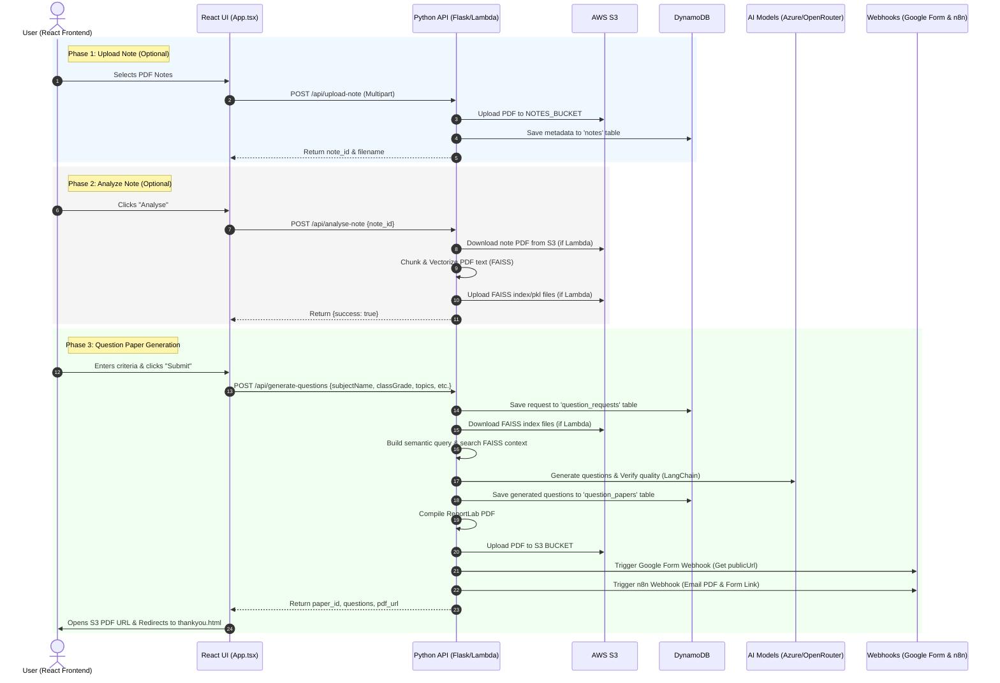

# 🔗 End-to-End Frontend-Backend Wiring Documentation

This document describes the complete wiring and data flow between the React frontend (`src/App.tsx`) and the Python backend handlers (Flask `backend/app.py` or Serverless `qplambda.py`) in the **Prashnotri** AI-powered Question Paper Generator.

---

## 🏗️ Architecture Overview

The application features a single-page React frontend built with TypeScript and Vite, which communicates with a Python-based REST API. The API is deployable in two ways:
1. **Server-based (Flask):** Managed using `backend/app.py` (served via Nginx/PM2 on EC2 or Hugging Face Spaces).
2. **Serverless (AWS Lambda):** Managed using `qplambda.py` wrapped inside a Docker container (`Dockerfile.lambda`) fronted by AWS API Gateway.

Both environments store files on AWS S3 and maintain metadata in AWS DynamoDB.



---

## 📡 API Wiring and Contract Definitions

All API routes are prefixed with `/api`. Both the Flask app and the Lambda router process these endpoints identically.

### 1. Upload Note PDF
* **Endpoint:** `POST /api/upload-note`
* **Content-Type:** `multipart/form-data`
* **Request Payload:**
  * `file`: Binary PDF file.
* **Backend Operations:**
  1. Validates that the file name ends with `.pdf`.
  2. Generates a unique S3 key: `notes/{YYYYMMDD_HHMMSS}_{original_filename}`.
  3. Uploads the file to `NOTES_BUCKET_NAME`.
  4. Inserts note metadata into the **DynamoDB Notes Table** (`notes`).
* **Response Payload (JSON):**
  ```json
  {
    "success": true,
    "note_id": "8a719c8f-287d-4180-87a3-e29f8c63f25c",
    "filename": "quantum_physics.pdf"
  }
  ```

### 2. Analyse Uploaded Note
* **Endpoint:** `POST /api/analyse-note`
* **Content-Type:** `application/json`
* **Request Payload:**
  ```json
  {
    "note_id": "8a719c8f-287d-4180-87a3-e29f8c63f25c"
  }
  ```
* **Backend Operations:**
  1. **Locate PDF:**
     * **Flask:** Uses the locally cached `temp_uploads/latest.pdf`.
     * **Lambda:** Pulls the file from S3 (`NOTES_BUCKET_NAME`) mapping to the metadata of `note_id`.
  2. **Semantic Processing:**
     * Invokes `generator.document_processor.process_uploaded_document` (utilizes `RecursiveCharacterTextSplitter` with subject-based variable sizes: Math = 800 chars, Science = 1200, Lit = 1500, Default = 1000).
     * Builds a local `FAISS` vector index using `OpenAIEmbeddings`.
  3. **Persist Index:**
     * **Flask:** Saves index locally to `vectorstores/latest`.
     * **Lambda:** Uploads `index.faiss` and `index.pkl` to `NOTES_BUCKET_NAME` under `vectorstores/{note_id}/` for subsequent stateless execution.
* **Response Payload (JSON):**
  ```json
  {
    "success": true
  }
  ```

### 3. Generate Questions
* **Endpoint:** `POST /api/generate-questions`
* **Content-Type:** `application/json`
* **Request Payload:**
  ```json
  {
    "email": "educator@example.com",
    "subjectName": "Science",
    "classGrade": "Grade 10",
    "language": "English",
    "topics": [
      {
        "sectionName": "Chemical Reactions",
        "questionType": "MCQ",
        "difficulty": "Medium",
        "bloomLevel": "Apply",
        "numQuestions": "3",
        "additionalInstructions": "Include carbon reactions.",
        "noteId": "8a719c8f-287d-4180-87a3-e29f8c63f25c"
      }
    ]
  }
  ```
* **Backend Operations:**
  1. Inserts the incoming request details into **DynamoDB Request Table** (`question_requests`) with a unique `request_id`.
  2. Loads the vector store context:
     * **Flask:** Checks if `vectorstores/latest` exists on disk.
     * **Lambda:** Downloads `index.faiss` and `index.pkl` from S3 `vectorstores/{note_id}/` to `/tmp/vectorstores/{note_id}/` and loads the store locally.
  3. Generates questions for each topic using `generator.question_generator.generate_questions`:
     * Performs vector similarity search with semantic query augmentation.
     * Runs prompt generation through the configured LLM (Azure OpenAI or OpenRouter fallback).
     * Verifies question quality using `generator.question_verifier` (verifies structure, correctness of answer, option counts, etc.) with up to 2 retry attempts.
  4. Saves the completed JSON paper details to the **DynamoDB Papers Table** (`question_papers`) under a new `paper_id`.
  5. Generates the PDF using `CreatePDF.generate(...)` (ReportLab) and uploads it to S3 (`S3_BUCKET_NAME`).
  6. **Google Form Webhook:** Calls `GOOGLE_FORM_WEBHOOK_URL` to spin up an interactive form, saving the returning `publicUrl` to the response object.
  7. **n8n Webhook:** Calls `N8N_WEBHOOK_URL` to send out the final notification email containing links to both the PDF and Google Form.
* **Response Payload (JSON):**
  ```json
  {
    "success": true,
    "paper_id": "fa2277d3-90d2-43f1-bd12-ef6f91f736ad",
    "questions": [
      {
        "topic": "Chemical Reactions",
        "questions": [
          {
            "question": "What is the product of combustion of carbon?",
            "options": ["CO2", "O2", "H2O", "N2"],
            "answer": "CO2",
            "explanation": "Combustion of carbon in excess oxygen produces Carbon Dioxide."
          }
        ],
        "cached": false
      }
    ],
    "pdf_url": "https://s3.amazonaws.com/my-bucket/question_paper_fa2277d3-90d2-43f1-bd12-ef6f91f736ad.pdf?AWSAccessKeyId=..."
  }
  ```

### 4. Fetch/Download PDF
* **Endpoint:** `GET /api/download-pdf/<paper_id>`
* **Backend Operations:**
  * Generates a fresh S3 presigned URL for `question_paper_{paper_id}.pdf` from `S3_BUCKET_NAME` with an expiration time of 1 hour (3600 seconds).
* **Response Payload (JSON):**
  ```json
  {
    "success": true,
    "url": "https://s3.amazonaws.com/my-bucket/question_paper_fa2277d3-90d2-43f1-bd12-ef6f91f736ad.pdf?AWSAccessKeyId=..."
  }
  ```

---

## 🗄️ Database & Storage Schemas

### 1. DynamoDB Tables

#### A. Request Table (`question_requests`)
Tracks the parameters sent by the user when requesting a paper.
* **Partition Key:** `request_id` (String, UUID)
* **Example Schema:**
  ```json
  {
    "request_id": "3c4a8fb9-65fe-4f11-8be8-2780ee2d1a33",
    "email": "user@example.com",
    "subjectName": "Science",
    "classGrade": "Grade 10",
    "language": "English",
    "topics": [...],
    "created_at": "2026-08-22 15:00:00"
  }
  ```

#### B. Paper Table (`question_papers`)
Stores the generated output questions and structural metadata.
* **Partition Key:** `paper_id` (String, UUID)
* **Example Schema:**
  ```json
  {
    "paper_id": "fa2277d3-90d2-43f1-bd12-ef6f91f736ad",
    "request_id": "3c4a8fb9-65fe-4f11-8be8-2780ee2d1a33",
    "questions": [
      {
        "topic": "Chemical Reactions",
        "questions": [
          {
            "question": "...",
            "options": ["A", "B", "C", "D"],
            "answer": "A",
            "explanation": "..."
          }
        ]
      }
    ],
    "created_at": "2026-08-22 15:01:10",
    "previous_paper_id": null
  }
  ```

#### C. Notes Table (`notes`)
Tracks uploaded source PDF documents.
* **Partition Key:** `note_id` (String, UUID)
* **Example Schema:**
  ```json
  {
    "note_id": "8a719c8f-287d-4180-87a3-e29f8c63f25c",
    "filename": "notes/20260822_150000_science_chapter1.pdf",
    "original_name": "science_chapter1.pdf",
    "uploaded_at": "2026-08-22 15:00:05",
    "s3_url": "s3://my-notes-bucket/notes/20260822_150000_science_chapter1.pdf"
  }
  ```

---

## 🌐 External Integrations & Webhooks

When a question paper is generated, the backend invokes external workflow platforms to deliver the content to the educator.

### 1. Google Form Creation Webhook (`GOOGLE_FORM_WEBHOOK_URL`)
* **Purpose:** Builds a digital quiz out of the generated questions.
* **Payload Sent:**
  ```json
  {
    "email": "user@example.com",
    "paper_name": "Science",
    "class_grade": "Grade 10",
    "all_questions": [...]
  }
  ```
* **Payload Expected:**
  ```json
  {
    "publicUrl": "https://docs.google.com/forms/d/e/1FAIpQLSf.../viewform"
  }
  ```

### 2. n8n Notification Webhook (`N8N_WEBHOOK_URL`)
* **Purpose:** Triggers email generation containing PDF attachment links and the online quiz form.
* **Payload Sent:**
  ```json
  {
    "email": "user@example.com",
    "paper_name": "Science",
    "class_grade": "Grade 10",
    "all_questions": [...],
    "topics": [...],
    "num_questions": 3,
    "google_form_url": "https://docs.google.com/forms/d/e/1FAIpQLSf.../viewform",
    "pdf_url": "https://s3.amazonaws.com/my-bucket/question_paper_fa2277d3-90d2-43f1-bd12-ef6f91f736ad.pdf?..."
  }
  ```

---

## 🛠️ Configuration & Environment Setup

The backend connects to AWS and AI services using the following `.env` settings:

```ini
# AWS Configuration
AWS_ACCESS_KEY_ID=your-access-key-id
AWS_SECRET_ACCESS_KEY=your-secret-access-key
AWS_REGION=us-east-1
S3_BUCKET_NAME=my-question-papers-bucket
NOTES_BUCKET_NAME=my-notes-bucket

# DynamoDB Configuration
DYNAMODB_TABLE_REQUESTS=question_requests
DYNAMODB_TABLE_PAPERS=question_papers
DYNAMODB_TABLE_NOTES=notes

# AI Models (Azure OpenAI)
AZURE_OPENAI_ENDPOINT=https://your-endpoint.openai.azure.com/
AZURE_OPENAI_API_KEY=your-azure-key
AZURE_OPENAI_API_VERSION=2023-05-15

# OpenRouter (Fallback API)
OPENROUTER_API_KEY=your-openrouter-key

# Webhooks
GOOGLE_FORM_WEBHOOK_URL=https://script.google.com/macros/s/.../exec
N8N_WEBHOOK_URL=https://n8n.yourdomain.com/webhook/...
```

> [!WARNING]
> **Code Synchronization Note:**
> The serverless handler [`qplambda.py`](file:///d:/Github_Codes/Question_paper/Question_maker_feedback_loop/qplambda.py) currently imports `mylang4`. However, `mylang4.py` has been refactored and integrated into the `backend/generator` package under [`generator.py`](file:///d:/Github_Codes/Question_paper/Question_maker_feedback_loop/backend/generator/generator.py).
> 
> To align both entry points, [`qplambda.py`](file:///d:/Github_Codes/Question_paper/Question_maker_feedback_loop/qplambda.py) should be updated to import `generator` from `backend.generator.generator` rather than `mylang4`, ensuring code reuse and version synchronization.
