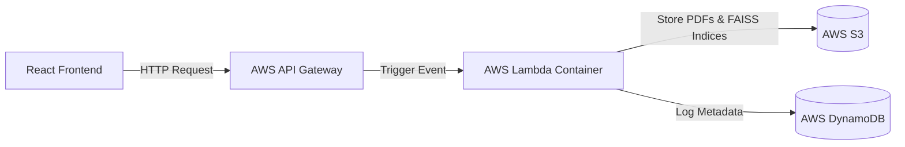

# 🚀 Serverless Deployment Guide: AWS Lambda & API Gateway

This document provides a step-by-step guide to deploying the **Prashnotri** backend as a serverless application using AWS Lambda, S3, DynamoDB, AWS ECR (Elastic Container Registry), and API Gateway.

---

## 🏗️ Architecture Overview

The backend uses large machine learning libraries (such as `langchain`, `faiss-cpu`, and `numpy`) which easily exceed the **250 MB size limit** of standard AWS Lambda ZIP package deployments. 

To bypass this limit, the application is deployed as a **Docker Container Image** using [`Dockerfile.lambda`](file:///d:/Github_Codes/Question_paper/Question_maker_feedback_loop/Dockerfile.lambda). AWS Lambda allows container images up to **10 GB** in size.



---

## 📋 Prerequisites

Before deploying, ensure you have the following installed and configured:
1. **Docker Desktop** installed and running.
2. **AWS CLI** installed and configured (`aws configure`).
3. Appropriate AWS permissions to manage **ECR, Lambda, API Gateway, IAM, S3, and DynamoDB**.
4. The AWS command-line tools logged into your account.

---

## 🛠️ Step-by-Step Deployment

### Step 1: Build the Docker Image Locally
Open your terminal at the root of the project (`Question_maker_feedback_loop`) and build the Lambda container image using the serverless-specific Dockerfile:

```bash
docker build -t prashnotri-lambda -f Dockerfile.lambda .
```

*Note: You can verify the image built successfully by running `docker images`.*

---

### Step 2: Push the Image to AWS ECR
AWS Lambda pulls container images from **Amazon Elastic Container Registry (ECR)**.

1. **Create an ECR Repository** (if you haven't already):
   ```bash
   aws ecr create-repository --repository-name prashnotri-backend --region us-east-1
   ```
   *Note: Save the `repositoryUri` output (e.g., `123456789012.dkr.ecr.us-east-1.amazonaws.com/prashnotri-backend`).*

2. **Authenticate Docker with your AWS ECR Registry:**
   ```bash
   aws ecr get-login-password --region us-east-1 | docker login --username AWS --password-stdin 123456789012.dkr.ecr.us-east-1.amazonaws.com
   ```
   *(Replace `123456789012` with your actual AWS Account ID).*

3. **Tag your local image to point to the ECR repo:**
   ```bash
   docker tag prashnotri-lambda:latest 123456789012.dkr.ecr.us-east-1.amazonaws.com/prashnotri-backend:latest
   ```

4. **Push the image to ECR:**
   ```bash
   docker push 123456789012.dkr.ecr.us-east-1.amazonaws.com/prashnotri-backend:latest
   ```

---

### Step 3: Configure AWS Lambda
1. **Create the Lambda Function:**
   * Go to the **AWS Lambda Console** ➔ **Create Function**.
   * Choose **Container Image**.
   * Set the function name (e.g., `Prashnotri-Backend-Lambda`).
   * Click **Browse Images** and select the `prashnotri-backend:latest` image you just pushed.
   * Under **Architecture**, match your build system (usually `x86_64`).
   * Click **Create function**.

2. **Adjust Configuration Settings (CRITICAL):**
   Because parsing PDFs and executing LLM retry loops requires extra memory and execution time, modify the default timeouts:
   * Go to **Configuration** ➔ **General Configuration** ➔ **Edit**.
   * **Memory:** Set to at least **1024 MB** (2048 MB is recommended for FAISS search performance).
   * **Timeout:** Set to **3 minutes** (180 seconds) to prevent timeout during long API/AI calls.

3. **Set Environment Variables:**
   * Go to **Configuration** ➔ **Environment Variables** ➔ **Edit**.
   * Add the variables matching your local `.env` configuration:
     * `S3_BUCKET_NAME`
     * `NOTES_BUCKET_NAME`
     * `DYNAMODB_TABLE_REQUESTS`
     * `DYNAMODB_TABLE_PAPERS`
     * `DYNAMODB_TABLE_NOTES`
     * `AZURE_OPENAI_API_KEY`
     * `AZURE_OPENAI_ENDPOINT`
     * `AZURE_OPENAI_API_VERSION`
     * `GOOGLE_FORM_WEBHOOK_URL`
     * `N8N_WEBHOOK_URL`
     * `AWS_REGION`

4. **Update the IAM Execution Role permissions:**
   * Go to **Configuration** ➔ **Permissions** and click on the role name link to open the IAM Console.
   * Attach a policy (or add inline permissions) allowing the Lambda function to access:
     * **S3:** `s3:GetObject`, `s3:PutObject`, `s3:DeleteObject` on your S3 buckets.
     * **DynamoDB:** `dynamodb:PutItem`, `dynamodb:GetItem`, `dynamodb:UpdateItem` on your DynamoDB tables.

---

### Step 4: Wire with AWS API Gateway

1. **Create HTTP API:**
   * Go to **AWS API Gateway Console** ➔ **Build HTTP API**.
   * Set API Name (e.g., `Prashnotri-API`).

2. **Configure Route Integration:**
   * Click **Routes** ➔ **Create**.
   * Select method: `ANY`.
   * Enter Path: `/api/{proxy+}`.
   * Click **Attach Integration** ➔ **Create Integration**.
   * Select **Integration Type:** `Lambda Function`.
   * Choose your Lambda function (`Prashnotri-Backend-Lambda`).
   * Click **Create**.

3. **Configure CORS in API Gateway (CRITICAL):**
   To allow your web browser client to make fetch calls to API Gateway:
   * In the API Gateway sidebar, click **CORS**.
   * Add the following configurations:
     * **Access-Control-Allow-Origin:** `*` (or your frontend domain)
     * **Access-Control-Allow-Headers:** `Content-Type,Authorization`
     * **Access-Control-Allow-Methods:** `GET,POST,OPTIONS`
     * Click **Save**.

4. **Deploy the API:**
   * Copy the **Invoke URL** generated by API Gateway (e.g., `https://abcdefgh12.execute-api.us-east-1.amazonaws.com`).

---

### Step 5: Update Frontend
In your React Frontend, change the base API endpoint URL to target the API Gateway **Invoke URL**. 

All API requests (like `POST /api/generate-questions`) will now route cleanly to API Gateway, which invokes the containerized Python Lambda to generate and verify your question papers!
