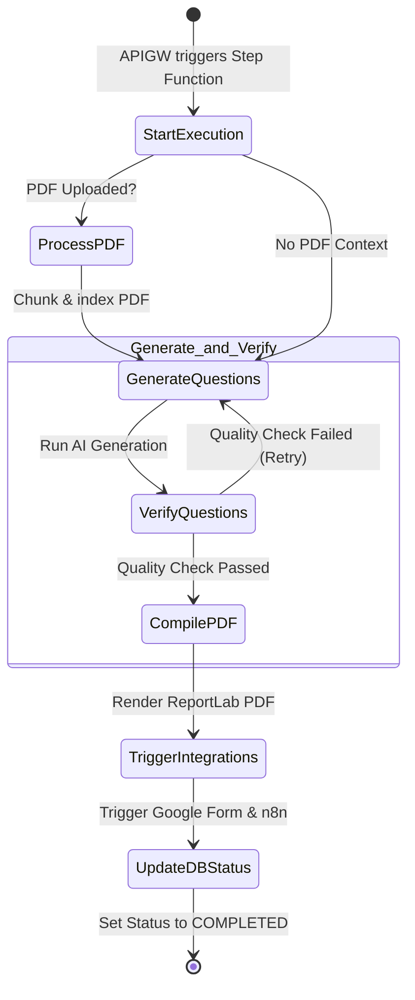

# ⛓️ Serverless Orchestration Guide: AWS Step Functions

Deploying the backend as a single Lambda function (`qplambda.py`) works well, but as the app grows, you run into serverless constraints:
1. **API Gateway Timeout (30s):** Even if AWS Lambda can run for 15 minutes, API Gateway forcefully cuts off connection after **30 seconds**. If AI generation and verification retry loops take 40 seconds, the frontend gets a `504 Gateway Timeout`.
2. **Monolithic Package Size:** Packaging `FAISS`, `LangChain`, `ReportLab`, and the webhooks dependencies into one container image increases cold-start latency.

Implementing an **AWS Step Functions State Machine** solves both issues by turning the process into an **Asynchronous Workflow** and splitting the monolithic Lambda into single-responsibility nodes.

---

## 🏗️ State Machine Architecture

Here is how the asynchronous Step Function workflow orchestrates the question paper generation:



---

## 🛠️ The Asynchronous Polling Pattern

Since the Step Function runs asynchronously in the background, the frontend uses a polling pattern:

```mermaid
sequenceDiagram
    actor Browser as Frontend (App.tsx)
    participant APIGW as API Gateway
    participant InitLambda as Start-Task Lambda
    participant SF as Step Functions
    participant DB as DynamoDB

    Browser->>APIGW: POST /api/generate-questions
    APIGW->>InitLambda: Invoke
    InitLambda->>SF: StartStateMacine(execution_name=task_id)
    InitLambda->>DB: Set status = 'PENDING'
    InitLambda-->>Browser: Return 202 Accepted (task_id)

    loop Every 3-5 seconds
        Browser->>APIGW: GET /api/status/{task_id}
        APIGW->>DB: Query task status
        DB-->>Browser: Return status ('GENERATING', 'VERIFYING', etc.)
    ```
    Note over Browser, DB: Once Step Function reaches the end, it updates DynamoDB status to 'COMPLETED' with the S3 PDF URL.
    Browser->>APIGW: GET /api/status/{task_id}
    APIGW-->>Browser: Return 200 OK (Questions JSON + S3 PDF Link)
```

---

## 📝 Step-by-Step Implementation

### Step 1: Split `qplambda.py` into micro-Lambdas
Break down your monolithic file into five individual Lambda functions. This allows you to allocate smaller memory footprints to functions that do not need machine learning packages (e.g., sending emails/webhooks):

1. **`start-task-lambda`**: Triggers the Step Function and writes initial state to DynamoDB. (Memory: 128MB)
2. **`process-pdf-lambda`**: Processes document, vectorizes, uploads FAISS index to S3. (Memory: 2048MB)
3. **`generate-questions-lambda`**: Loads vector context from S3, queries LLM. (Memory: 1024MB)
4. **`compile-pdf-lambda`**: Builds PDF using ReportLab and uploads it to S3. (Memory: 512MB)
5. **`trigger-webhooks-lambda`**: Invokes Google Forms and n8n webhooks. (Memory: 128MB)

---

### Step 2: Define the Amazon States Language (ASL)
Go to the **AWS Step Functions Console** and create a state machine using this JSON definition (ASL):

```json
{
  "Comment": "Prashnotri Asynchronous Question Paper Generation Workflow",
  "StartAt": "CheckPdfContext",
  "States": {
    "CheckPdfContext": {
      "Type": "Choice",
      "Choices": [
        {
          "Variable": "$.noteId",
          "IsPresent": true,
          "Next": "ProcessPDF"
        }
      ],
      "Default": "GenerateQuestions"
    },
    "ProcessPDF": {
      "Type": "Task",
      "Resource": "arn:aws:lambda:us-east-1:123456789012:function:process-pdf-lambda",
      "Next": "GenerateQuestions"
    },
    "GenerateQuestions": {
      "Type": "Task",
      "Resource": "arn:aws:lambda:us-east-1:123456789012:function:generate-questions-lambda",
      "Next": "VerifyQuestions"
    },
    "VerifyQuestions": {
      "Type": "Choice",
      "Choices": [
        {
          "Variable": "$.verification_result.overall_verdict",
          "StringEquals": "Pass",
          "Next": "CompilePDF"
        }
      ],
      "Default": "HandleRetryCheck"
    },
    "HandleRetryCheck": {
      "Type": "Choice",
      "Choices": [
        {
          "Variable": "$.attempts_used",
          "NumericLessThan": 3,
          "Next": "GenerateQuestions"
        }
      ],
      "Default": "WorkflowFailed"
    },
    "CompilePDF": {
      "Type": "Task",
      "Resource": "arn:aws:lambda:us-east-1:123456789012:function:compile-pdf-lambda",
      "Next": "TriggerIntegrations"
    },
    "TriggerIntegrations": {
      "Type": "Task",
      "Resource": "arn:aws:lambda:us-east-1:123456789012:function:trigger-webhooks-lambda",
      "Next": "UpdateStatusCompleted"
    },
    "UpdateStatusCompleted": {
      "Type": "Task",
      "Resource": "arn:aws:lambda:us-east-1:123456789012:function:update-db-status-lambda",
      "End": true
    },
    "WorkflowFailed": {
      "Type": "Fail",
      "Error": "ValidationFailed",
      "Cause": "Generated questions failed quality verification after max retries."
    }
  }
}
```

---

### Step 3: Implement Status Polling Endpoint
Create a new API route in API Gateway (`GET /api/status/{task_id}`) pointing to a Lambda that reads execution metadata from DynamoDB:

```python
# GET /api/status/{task_id} handler
def handle_get_status(event):
    task_id = event['pathParameters']['task_id']
    response = papers_table.get_item(Key={'paper_id': task_id})
    
    if 'Item' not in response:
        return make_response(404, {'status': 'NOT_FOUND'})
        
    item = response['Item']
    return make_response(200, {
        'status': item.get('status'),              # e.g., 'GENERATING', 'COMPLETED'
        'pdf_url': item.get('pdf_url'),            # present once COMPLETED
        'questions': item.get('questions')         # present once COMPLETED
    })
```

---

### Step 4: Update React Frontend (`App.tsx`)
Modify your submission handler in React to support polling:

```typescript
const onSubmit = async (data: any) => {
  // 1. Start the task
  const initResponse = await fetch('/api/generate-questions', {
    method: 'POST',
    body: JSON.stringify(data)
  });
  const { task_id } = await initResponse.json();

  // 2. Poll the status endpoint
  const pollInterval = setInterval(async () => {
    const statusResponse = await fetch(`/api/status/${task_id}`);
    const result = await statusResponse.json();

    if (result.status === 'COMPLETED') {
      clearInterval(pollInterval);
      setQuestions(result.questions);
      setPdfUrl(result.pdf_url);
      setLoading(false);
    } else if (result.status === 'FAILED') {
      clearInterval(pollInterval);
      setError("Failed to generate questions. Quality check failed.");
      setLoading(false);
    } else {
      // Update loader message based on status: 'GENERATING', 'VERIFYING', etc.
      setLoaderMessage(`Status: ${result.status}...`);
    }
  }, 3000); // Poll every 3 seconds
};
```
